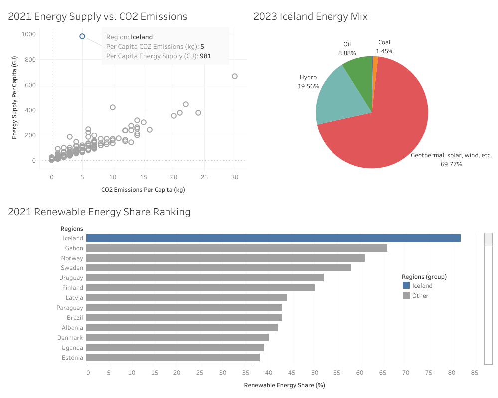

# Data Analysis (Python, SQL, Tableau)

## Introduction
This project demonstrates the use of Python, SQL, and Tableau in data analysis. A total of 6 csv files were processed in Python and loaded to MySQL. The data were queried and loaded to Tableau for visualization. 

## Data Source
- Per capita energy, CO2 emissions, and GDP data came from [UN](https://data.un.org/).
- Worldwide shares of modern renewable energy data came from [IEA](https://www.iea.org/countries/argentina/renewables).
- Iceland energy mix data also came from [IEA](https://www.iea.org/countries/iceland/energy-mix
).
- ISO3 country code data came from [World Bank](https://wits.worldbank.org/wits/wits/witshelp/content/codes/country_codes.htm).

## Result
- This [Jupyter Notebook](Process_CSV_files_and_send_to_MySQL.ipynb) shows how the 6 csv files were cleaned in Python and loaded to MySQL database.
- This [SQL script](mysql_queries.sql) shows that the UN data were queried together based on the matching year and region and that the ISO3 country codes were joined with the corresponding country names.
- Iceland stood out as the highest per capita energy consumption region while having relatively low emissions in 2021. In the same year, it had the most renewable energy share at over 80%. The 2023 data showed that 69.77% of the energy came from geothermal/solar/wind while 19.56% accounted for hydropower.

The dashboard can be viewed on [Tableau Public](https://public.tableau.com/app/profile/boeun.choi7767/vizzes).