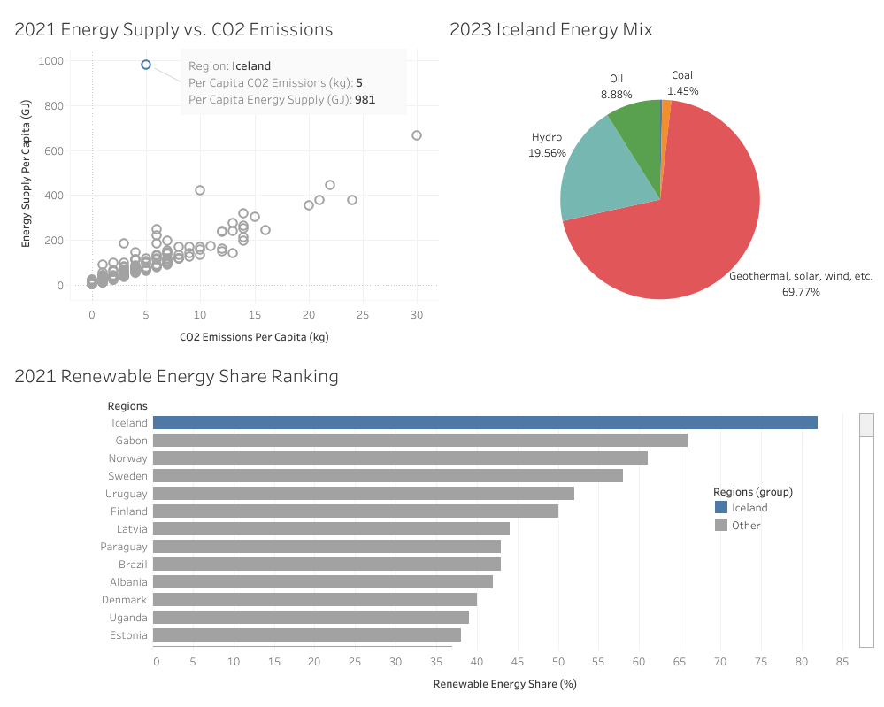

# Data Analysis (Python, SQL, Tableau)

## Introduction
This project demonstrates the use of Python, SQL, and Tableau in data anlaysis. A total of 6 csv files were processed in Python and loaded to MySQL. The data were queried and loaded to Tableau for visualization. 

## Data Source
-Per capita energy, CO2 emissions, and GDP data came from [UN](https://data.un.org/).
-Share of modern renewable energy global ranking data came from [IEA](https://www.iea.org/countries/argentina/renewables).
-Iceland energy mix data also came from [IEA](https://www.iea.org/countries/iceland/energy-mix
).
-ISO3 country code data came from [World Bank](https://wits.worldbank.org/wits/wits/witshelp/content/codes/country_codes.htm).

## Result

